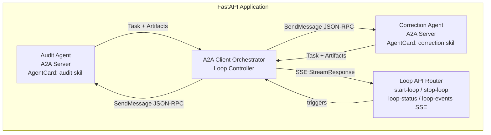

# Phase 4 — Correction Agent & Iterative Audit Loop (A2A Protocol v1.0)

> **Prerequisites**: Phase 3 complete — Audit Agent produces structured JSON reports, audit API endpoints work, audit reports are stored in Postgres.
> **Ref**: [phase-0-index.md](phase-0-index.md) for pinned versions.

---

## Objective

Wrap the Phase 3 Audit Agent and a new LangGraph Correction Agent as **official A2A Protocol v1.0 agent servers** using the `a2a-sdk` Python package. Implement an A2A client orchestrator that coordinates the iterative audit-correct loop via standard JSON-RPC 2.0 messaging, SSE streaming for real-time progress, and agent discovery via `AgentCard` endpoints.

---

## A2A Protocol v1.0 — Architecture Overview



---

## Key A2A v1.0 Concepts Used

| Concept | SDK Type | Usage |
|---|---|---|
| Agent identity | `AgentCard`, `AgentSkill` | Each agent publishes a card describing its capabilities |
| Task lifecycle | `Task`, `TaskState`, `TaskStatus` | SUBMITTED → WORKING → COMPLETED/FAILED |
| Messages | `Message`, `Part` — TextPart, DataPart | Structured communication between agents |
| Artifacts | `Artifact` | Agent outputs: audit reports, corrected documents |
| Streaming | `SendStreamingMessage`, `TaskStatusUpdateEvent` | Real-time progress via SSE |
| Client | `a2a.client` | Orchestrator sends messages to agent servers |
| Server | `a2a.server` | Agents receive and process messages |
| Discovery | `/.well-known/agent-card.json` | Agent capability advertisement |

---

## Task 1: Define Agent Cards & A2A Type Helpers

**Working directory**: `rag-pipeline/apps/api/src/agents/`

### 1.1 Create `a2a_agent_cards.py`

```python
"""A2A Protocol v1.0 — Agent Card definitions for Audit and Correction agents."""

from a2a.types import AgentCard, AgentSkill, AgentCapabilities


def build_audit_agent_card(base_url: str) -> AgentCard:
    """Build the AgentCard for the Audit Agent."""
    return AgentCard(
        name="RAG Pipeline Audit Agent",
        description="Validates Markdown documents against a 10-rule schema. "
        "Produces structured audit reports with issue classifications.",
        url=f"{base_url}/a2a/audit",
        version="1.0.0",
        capabilities=AgentCapabilities(streaming=True, pushNotifications=False),
        skills=[
            AgentSkill(
                id="audit-documents",
                name="Audit Documents",
                description="Run schema validation and quality audit on staged Markdown documents.",
                tags=["audit", "validation", "markdown", "quality"],
                examples=["Audit all documents for job abc-123"],
                inputModes=["application/json"],
                outputModes=["application/json"],
            ),
        ],
    )


def build_correction_agent_card(base_url: str) -> AgentCard:
    """Build the AgentCard for the Correction Agent."""
    return AgentCard(
        name="RAG Pipeline Correction Agent",
        description="Classifies audit issues as LEGITIMATE or FALSE_POSITIVE using an LLM, "
        "then applies corrections to Markdown documents.",
        url=f"{base_url}/a2a/correction",
        version="1.0.0",
        capabilities=AgentCapabilities(streaming=True, pushNotifications=False),
        skills=[
            AgentSkill(
                id="correct-documents",
                name="Correct Documents",
                description="Classify audit issues and apply corrections to Markdown documents.",
                tags=["correction", "markdown", "llm", "classification"],
                examples=["Correct documents based on audit report rpt-456"],
                inputModes=["application/json"],
                outputModes=["application/json"],
            ),
        ],
    )
```

### 1.2 Create `a2a_helpers.py`

```python
"""A2A Protocol v1.0 — Helper functions for Messages, Parts, and Artifacts."""

import uuid
from datetime import datetime, timezone

from a2a.types import (
    Artifact, DataPart, Message, Part, Role,
    Task, TaskState, TaskStatus, TextPart,
)


def make_user_message(context_id: str, data: dict, text: str = "") -> Message:
    """Build a ROLE_USER Message with a DataPart payload."""
    parts: list[Part] = []
    if text:
        parts.append(TextPart(text=text))
    parts.append(DataPart(data=data))
    return Message(
        messageId=str(uuid.uuid4()),
        role=Role.ROLE_USER,
        parts=parts,
        contextId=context_id,
    )


def make_agent_message(context_id: str, task_id: str, text: str, data: dict | None = None) -> Message:
    """Build a ROLE_AGENT Message with text and optional data."""
    parts: list[Part] = [TextPart(text=text)]
    if data:
        parts.append(DataPart(data=data))
    return Message(
        messageId=str(uuid.uuid4()),
        role=Role.ROLE_AGENT,
        parts=parts,
        contextId=context_id,
        taskId=task_id,
    )


def make_task_status(state: TaskState, message: Message | None = None) -> TaskStatus:
    """Build a TaskStatus with current timestamp."""
    return TaskStatus(
        state=state,
        message=message,
        timestamp=datetime.now(timezone.utc).isoformat(),
    )


def make_artifact(name: str, description: str, data: dict) -> Artifact:
    """Build an Artifact containing a DataPart."""
    return Artifact(
        artifactId=str(uuid.uuid4()),
        name=name,
        description=description,
        parts=[DataPart(data=data)],
    )


def extract_artifact_data(task: Task) -> dict:
    """Extract the first DataPart from the first artifact of a Task."""
    if task.artifacts:
        for part in task.artifacts[0].parts:
            if hasattr(part, "data"):
                return part.data
    return {}
```

**Done when**: `AgentCard` objects can be constructed for both agents; helper functions produce valid `Message`, `Task`, and `Artifact` instances.

---

## Task 2: Build the Correction Agent LangGraph + A2A Server

**Working directory**: `rag-pipeline/apps/api/src/agents/`

### 2.1 Create `correction_state.py`

```python
"""State definition for the Correction Agent LangGraph workflow."""

from typing import TypedDict


class CorrectionIssue(TypedDict):
    issue_id: str
    issue_type: str
    severity: str
    field: str | None
    message: str
    line: int | None
    suggestion: str | None
    classification: str  # "LEGITIMATE" | "FALSE_POSITIVE" | "pending"
    reasoning: str
    correction: str


class CorrectionDocInfo(TypedDict):
    doc_id: str
    doc_path: str
    url: str
    title: str
    original_content: str
    corrected_content: str
    issues: list[CorrectionIssue]
    changes_made: list[str]
    status: str  # "pending" | "corrected" | "unchanged"


class CorrectionState(TypedDict):
    job_id: str
    round: int
    report_id: str
    documents: list[CorrectionDocInfo]
    total_legitimate: int
    total_false_positive: int
    total_corrected: int
    status: str  # "running" | "complete"
```

### 2.2 Create `correction_agent.py`

The LangGraph correction workflow is a 6-node graph: receive → classify → plan → apply → save → emit. It returns structured results that the A2A server wrapper converts into `Task` updates and `Artifact` outputs.

> **Full code**: See [Subtask 1](phase-4/subtasks/phase-4-subtask-1-a2a-protocol-and-correction-agent.md) for the complete `correction_agent.py` implementation.

### 2.3 Create `a2a_correction_server.py` — A2A Server Wrapper

```python
"""A2A Protocol v1.0 server wrapper for the Correction Agent."""

import uuid
from a2a.server import A2AServer, TaskHandler
from a2a.types import SendMessageRequest, Task, TaskState

from src.agents.correction_agent import run_correction
from src.agents.a2a_helpers import make_agent_message, make_task_status, make_artifact

import structlog
logger = structlog.get_logger()


class CorrectionTaskHandler(TaskHandler):
    """Handle incoming A2A messages for the Correction Agent."""

    async def on_message(self, request: SendMessageRequest) -> Task:
        message = request.message
        task_id = str(uuid.uuid4())
        context_id = message.contextId or str(uuid.uuid4())

        # Extract payload from DataPart
        payload = {}
        for part in message.parts:
            if hasattr(part, "data"):
                payload = part.data
                break

        job_id = payload.get("job_id", "")
        correction_round = payload.get("round", 1)
        report_id = payload.get("report_id", "")

        task = Task(
            id=task_id, contextId=context_id,
            status=make_task_status(TaskState.TASK_STATE_WORKING),
            history=[message], artifacts=[],
        )

        try:
            result = await run_correction(job_id, correction_round, report_id)
            artifact = make_artifact(
                name=f"correction-report-round-{correction_round}",
                description=f"Correction results for job {job_id} round {correction_round}",
                data={
                    "total_corrected": result.get("total_corrected", 0),
                    "total_legitimate": result.get("total_legitimate", 0),
                    "total_false_positive": result.get("total_false_positive", 0),
                    "status": result.get("status", "complete"),
                },
            )
            completion_msg = make_agent_message(
                context_id=context_id, task_id=task_id,
                text=f"Correction complete: {result.get('total_corrected', 0)} docs corrected.",
            )
            task.status = make_task_status(TaskState.TASK_STATE_COMPLETED, completion_msg)
            task.artifacts = [artifact]
        except Exception as e:
            logger.error("correction_task_failed", error=str(e))
            error_msg = make_agent_message(context_id=context_id, task_id=task_id, text=f"Correction failed: {e}")
            task.status = make_task_status(TaskState.TASK_STATE_FAILED, error_msg)

        return task
```

### 2.4 Create `a2a_audit_server.py` — A2A Server Wrapper for Audit Agent

```python
"""A2A Protocol v1.0 server wrapper for the Audit Agent (Phase 3)."""

import uuid
from a2a.server import A2AServer, TaskHandler
from a2a.types import SendMessageRequest, Task, TaskState

from src.agents.audit_agent import run_audit
from src.agents.a2a_helpers import make_agent_message, make_task_status, make_artifact

import structlog
logger = structlog.get_logger()


class AuditTaskHandler(TaskHandler):
    """Handle incoming A2A messages for the Audit Agent."""

    async def on_message(self, request: SendMessageRequest) -> Task:
        message = request.message
        task_id = str(uuid.uuid4())
        context_id = message.contextId or str(uuid.uuid4())

        payload = {}
        for part in message.parts:
            if hasattr(part, "data"):
                payload = part.data
                break

        job_id = payload.get("job_id", "")
        audit_round = payload.get("round", 1)

        task = Task(
            id=task_id, contextId=context_id,
            status=make_task_status(TaskState.TASK_STATE_WORKING),
            history=[message], artifacts=[],
        )

        try:
            result = await run_audit(job_id, audit_round=audit_round)
            artifact = make_artifact(
                name=f"audit-report-round-{audit_round}",
                description=f"Audit results for job {job_id} round {audit_round}",
                data={
                    "report_id": result.get("report_id", ""),
                    "total_issues": result.get("total_issues", 0),
                    "status": result.get("status", ""),
                },
            )
            completion_msg = make_agent_message(
                context_id=context_id, task_id=task_id,
                text=f"Audit complete: {result.get('total_issues', 0)} issues found.",
                data={"report_id": result.get("report_id", ""), "total_issues": result.get("total_issues", 0)},
            )
            task.status = make_task_status(TaskState.TASK_STATE_COMPLETED, completion_msg)
            task.artifacts = [artifact]
        except Exception as e:
            logger.error("audit_task_failed", error=str(e))
            error_msg = make_agent_message(context_id=context_id, task_id=task_id, text=f"Audit failed: {e}")
            task.status = make_task_status(TaskState.TASK_STATE_FAILED, error_msg)

        return task
```

**Done when**: Both A2A server wrappers accept `SendMessageRequest`, invoke the underlying LangGraph agents, and return `Task` objects with proper `TaskState` lifecycle and `Artifact` outputs.

---

## Task 3: Build the A2A Client Orchestrator

**Working directory**: `rag-pipeline/apps/api/src/agents/`

### 3.1 Create `a2a_loop_orchestrator.py`

```python
"""A2A Protocol v1.0 client orchestrator for the iterative Audit <-> Correct loop."""

import uuid
from a2a.client import A2AClient
from a2a.types import Task, TaskState

from src.agents.a2a_helpers import make_user_message, extract_artifact_data

import structlog
logger = structlog.get_logger()

DEFAULT_MAX_ROUNDS = 10


async def run_audit_correct_loop(
    audit_client: A2AClient,
    correction_client: A2AClient,
    job_id: str,
    max_rounds: int = DEFAULT_MAX_ROUNDS,
    starting_round: int = 1,
) -> dict:
    """Run the Audit <-> Correct loop using A2A protocol clients."""
    context_id = str(uuid.uuid4())
    rounds_log: list[dict] = []
    current_round = starting_round

    while current_round <= max_rounds:
        logger.info("loop_round_start", job_id=job_id, round=current_round)

        # Step 1: Send audit request via A2A
        audit_message = make_user_message(
            context_id=context_id,
            data={"job_id": job_id, "round": current_round},
            text=f"Audit documents for job {job_id}, round {current_round}",
        )
        audit_task: Task = await audit_client.send_message(audit_message)

        audit_data = extract_artifact_data(audit_task)
        round_entry = {
            "round": current_round,
            "audit_task_id": audit_task.id,
            "audit_task_state": audit_task.status.state,
            "audit_issues": audit_data.get("total_issues", 0),
            "audit_status": audit_data.get("status", ""),
            "report_id": audit_data.get("report_id", ""),
            "correction_applied": False,
            "docs_corrected": 0,
            "false_positives": 0,
        }

        # Check for audit failure
        if audit_task.status.state == TaskState.TASK_STATE_FAILED:
            rounds_log.append(round_entry)
            return {"status": "failed", "final_round": current_round, "rounds": rounds_log,
                    "reason": "Audit agent failed"}

        # Step 2: Check if approved (zero issues)
        if audit_data.get("status") == "approved":
            rounds_log.append(round_entry)
            logger.info("loop_approved", job_id=job_id, final_round=current_round)
            return {"status": "approved", "final_round": current_round,
                    "total_rounds": current_round - starting_round + 1, "rounds": rounds_log}

        # Step 3: Send correction request via A2A
        correction_message = make_user_message(
            context_id=context_id,
            data={"job_id": job_id, "round": current_round, "report_id": audit_data.get("report_id", "")},
            text=f"Correct documents for job {job_id}, round {current_round}",
        )
        correction_task: Task = await correction_client.send_message(correction_message)

        correction_data = extract_artifact_data(correction_task)
        round_entry["correction_applied"] = True
        round_entry["correction_task_id"] = correction_task.id
        round_entry["correction_task_state"] = correction_task.status.state
        round_entry["docs_corrected"] = correction_data.get("total_corrected", 0)
        round_entry["false_positives"] = correction_data.get("total_false_positive", 0)
        rounds_log.append(round_entry)

        current_round += 1

    # Max rounds exceeded — escalate
    logger.warning("loop_escalated", job_id=job_id, max_rounds=max_rounds)
    return {
        "status": "escalated",
        "final_round": current_round - 1,
        "total_rounds": max_rounds,
        "rounds": rounds_log,
        "reason": f"Max rounds ({max_rounds}) exceeded",
    }
```

**Done when**: `await run_audit_correct_loop(audit_client, correction_client, job_id)` iterates audit/correct rounds using A2A protocol until convergence or max_rounds.

---

## Task 4: Build Loop API Endpoints & Agent Discovery

**Working directory**: `rag-pipeline/apps/api/src/routers/`

### 4.1 Create `loop.py`

```python
"""API routes for the audit-correct loop orchestration and A2A agent discovery."""

import uuid
from fastapi import APIRouter, Depends, HTTPException, Query
from fastapi.responses import JSONResponse
from sqlalchemy import select
from sqlalchemy.ext.asyncio import AsyncSession

from src.database import get_db
from src.models import IngestionJob, JobStatus
from src.agents.a2a_loop_orchestrator import run_audit_correct_loop
from src.agents.a2a_agent_cards import build_audit_agent_card, build_correction_agent_card

import structlog
logger = structlog.get_logger()

router = APIRouter()


@router.post("/jobs/{job_id}/start-loop", status_code=202)
async def start_audit_loop(
    job_id: uuid.UUID,
    max_rounds: int = Query(default=10, ge=1, le=50),
    db: AsyncSession = Depends(get_db),
):
    """Start the iterative audit-correct loop using A2A protocol."""
    result = await db.execute(select(IngestionJob).where(IngestionJob.id == job_id))
    job = result.scalar_one_or_none()
    if not job:
        raise HTTPException(status_code=404, detail="Job not found")

    starting_round = job.current_audit_round + 1
    job.status = JobStatus.AUDITING
    await db.commit()

    # Create A2A clients for both agents
    from a2a.client import A2AClient
    base_url = "http://localhost:8000"
    audit_client = A2AClient(url=f"{base_url}/a2a/audit")
    correction_client = A2AClient(url=f"{base_url}/a2a/correction")

    loop_result = await run_audit_correct_loop(
        audit_client=audit_client,
        correction_client=correction_client,
        job_id=str(job_id),
        max_rounds=max_rounds,
        starting_round=starting_round,
    )

    if loop_result["status"] in ("approved", "escalated"):
        job.status = JobStatus.REVIEW
    job.current_audit_round = loop_result["final_round"]
    await db.commit()

    return loop_result


@router.post("/jobs/{job_id}/stop-loop", status_code=200)
async def stop_audit_loop(
    job_id: uuid.UUID,
    db: AsyncSession = Depends(get_db),
):
    """Force-stop the audit loop and proceed to human review."""
    result = await db.execute(select(IngestionJob).where(IngestionJob.id == job_id))
    job = result.scalar_one_or_none()
    if not job:
        raise HTTPException(status_code=404, detail="Job not found")
    job.status = JobStatus.REVIEW
    await db.commit()
    return {"status": "stopped", "message": "Loop stopped. Job sent to human review."}


@router.get("/jobs/{job_id}/loop-status")
async def get_loop_status(job_id: uuid.UUID, db: AsyncSession = Depends(get_db)):
    """Get the current loop status for a job."""
    result = await db.execute(select(IngestionJob).where(IngestionJob.id == job_id))
    job = result.scalar_one_or_none()
    if not job:
        raise HTTPException(status_code=404, detail="Job not found")
    return {
        "job_id": str(job_id),
        "status": job.status,
        "current_round": job.current_audit_round,
    }
```

### 4.2 Create `a2a_discovery.py` — Agent Discovery Endpoints

```python
"""A2A Protocol v1.0 — Agent discovery endpoints."""

from fastapi import APIRouter
from fastapi.responses import JSONResponse

from src.agents.a2a_agent_cards import build_audit_agent_card, build_correction_agent_card

router = APIRouter()

BASE_URL = "http://localhost:8000"


@router.get("/a2a/audit/.well-known/agent-card.json")
async def audit_agent_card():
    """Serve the Audit Agent's AgentCard for A2A discovery."""
    card = build_audit_agent_card(BASE_URL)
    return JSONResponse(
        content=card.model_dump(),
        media_type="application/a2a+json",
        headers={"A2A-Version": "1.0"},
    )


@router.get("/a2a/correction/.well-known/agent-card.json")
async def correction_agent_card():
    """Serve the Correction Agent's AgentCard for A2A discovery."""
    card = build_correction_agent_card(BASE_URL)
    return JSONResponse(
        content=card.model_dump(),
        media_type="application/a2a+json",
        headers={"A2A-Version": "1.0"},
    )
```

### 4.3 Register routers in `src/main.py`

```python
from src.routers import health, jobs, websocket, audit, loop, a2a_discovery

app.include_router(loop.router, prefix="/api/v1", tags=["loop"])
app.include_router(a2a_discovery.router, tags=["a2a-discovery"])
```

**Done when**: Loop API endpoints work, agent discovery endpoints serve valid `AgentCard` JSON with `application/a2a+json` media type.

---

## Task 5: Build Loop Monitoring UI

**Working directory**: `rag-pipeline/apps/web/`

### 5.1 Create RTK Query endpoints — `src/store/api/loop-api.ts`

```typescript
import { apiSlice } from "./api-slice";

export interface LoopRound {
  round: number;
  audit_task_id: string;
  audit_task_state: string;
  audit_issues: number;
  audit_status: string;
  report_id: string;
  correction_applied: boolean;
  correction_task_id?: string;
  correction_task_state?: string;
  docs_corrected: number;
  false_positives: number;
}

export interface LoopResult {
  status: string;
  final_round: number;
  total_rounds: number;
  rounds: LoopRound[];
  reason?: string;
}

export interface LoopStatus {
  job_id: string;
  status: string;
  current_round: number;
}

export const loopApi = apiSlice.injectEndpoints({
  endpoints: (builder) => ({
    startLoop: builder.mutation<LoopResult, { jobId: string; maxRounds?: number }>({
      query: ({ jobId, maxRounds }) => ({
        url: `/jobs/${jobId}/start-loop${maxRounds ? `?max_rounds=${maxRounds}` : ""}`,
        method: "POST",
      }),
    }),
    stopLoop: builder.mutation<{ status: string; message: string }, string>({
      query: (jobId) => ({ url: `/jobs/${jobId}/stop-loop`, method: "POST" }),
    }),
    getLoopStatus: builder.query<LoopStatus, string>({
      query: (jobId) => `/jobs/${jobId}/loop-status`,
    }),
  }),
});

export const { useStartLoopMutation, useStopLoopMutation, useGetLoopStatusQuery } = loopApi;
```

### 5.2 Create Loop Monitor page — `src/app/loop/[jobId]/page.tsx`

```tsx
"use client";

import { use, useState } from "react";
import { Card, CardContent, CardHeader, CardTitle } from "@/components/ui/card";
import { Badge } from "@/components/ui/badge";
import { Button } from "@/components/ui/button";
import {
  useStartLoopMutation,
  useStopLoopMutation,
  useGetLoopStatusQuery,
  type LoopRound,
} from "@/store/api/loop-api";

export default function LoopPage({ params }: { params: Promise<{ jobId: string }> }) {
  const { jobId } = use(params);
  const [startLoop, { data: loopResult, isLoading: isRunning }] = useStartLoopMutation();
  const [stopLoop] = useStopLoopMutation();
  const { data: loopStatus } = useGetLoopStatusQuery(jobId, { pollingInterval: 5000 });
  const [maxRounds, setMaxRounds] = useState(10);

  return (
    <main className="container mx-auto p-8">
      <div className="flex items-center justify-between mb-8">
        <h1 className="text-3xl font-bold">Audit-Correct Loop — A2A Protocol</h1>
        <div className="flex items-center gap-4">
          <label className="text-sm">
            Max Rounds:
            <input type="number" value={maxRounds}
              onChange={(e) => setMaxRounds(Number(e.target.value))}
              min={1} max={50} className="ml-2 w-16 border rounded px-2 py-1" />
          </label>
          <Button onClick={() => startLoop({ jobId, maxRounds })} disabled={isRunning}>
            {isRunning ? "Running..." : "Start Loop"}
          </Button>
          <Button variant="destructive" onClick={() => stopLoop(jobId)}>Force Stop</Button>
        </div>
      </div>

      {loopStatus && (
        <Card className="mb-4">
          <CardContent className="pt-4">
            <p className="text-sm">Status: <Badge>{loopStatus.status}</Badge> — Round: {loopStatus.current_round}</p>
          </CardContent>
        </Card>
      )}

      {loopResult && (
        <Card className="mb-8">
          <CardHeader>
            <CardTitle className="flex items-center gap-2">
              Loop Result
              <Badge variant={loopResult.status === "approved" ? "default" : "destructive"}>
                {loopResult.status}
              </Badge>
            </CardTitle>
          </CardHeader>
          <CardContent>
            <div className="flex items-center gap-2 overflow-x-auto pb-4">
              {loopResult.rounds.map((round: LoopRound) => (
                <div key={round.round}
                  className="flex flex-col items-center min-w-[160px] p-4 border rounded-lg">
                  <span className="text-xs font-semibold mb-1">Round {round.round}</span>
                  <Badge variant={round.audit_issues === 0 ? "default" : "destructive"} className="mb-2">
                    {round.audit_issues} issues
                  </Badge>
                  <span className="text-xs text-muted-foreground mb-1">
                    Task: {round.audit_task_state}
                  </span>
                  {round.correction_applied && (
                    <div className="text-xs text-center">
                      <p>{round.docs_corrected} docs fixed</p>
                      <p>{round.false_positives} false positives</p>
                    </div>
                  )}
                  {round.audit_status === "approved" && (
                    <span className="text-green-600 text-lg mt-1">✓</span>
                  )}
                </div>
              ))}
            </div>
            {loopResult.reason && (
              <p className="text-sm text-muted-foreground mt-2">⚠️ {loopResult.reason}</p>
            )}
          </CardContent>
        </Card>
      )}
    </main>
  );
}
```

### 5.3 Add navigation link in layout

```tsx
<a href="/loop" className="text-sm hover:underline">Loop Monitor</a>
```

**Done when**: `/loop/{jobId}` renders the round timeline with A2A task states and issue count trend.

---

## Task 6: Write Phase 4 Tests

**Working directory**: `rag-pipeline/apps/api/`

### 6.1 Create `tests/test_a2a_helpers.py`

```python
"""Tests for A2A helper functions and agent card builders."""

import pytest
from a2a.types import TaskState, Role

from src.agents.a2a_helpers import (
    make_user_message, make_agent_message, make_task_status, make_artifact, extract_artifact_data,
)
from src.agents.a2a_agent_cards import build_audit_agent_card, build_correction_agent_card


def test_make_user_message_has_data_part():
    """User message should contain a DataPart with the provided data."""
    msg = make_user_message(context_id="ctx-1", data={"job_id": "j1"}, text="Hello")
    assert msg.role == Role.ROLE_USER
    assert msg.contextId == "ctx-1"
    assert len(msg.parts) == 2  # TextPart + DataPart
    assert hasattr(msg.parts[1], "data")
    assert msg.parts[1].data["job_id"] == "j1"


def test_make_agent_message_has_text():
    """Agent message should contain a TextPart."""
    msg = make_agent_message(context_id="ctx-1", task_id="t-1", text="Done")
    assert msg.role == Role.ROLE_AGENT
    assert msg.taskId == "t-1"
    assert hasattr(msg.parts[0], "text")
    assert msg.parts[0].text == "Done"


def test_make_task_status_working():
    """TaskStatus should have the correct state and timestamp."""
    status = make_task_status(TaskState.TASK_STATE_WORKING)
    assert status.state == TaskState.TASK_STATE_WORKING
    assert status.timestamp is not None


def test_make_artifact_contains_data():
    """Artifact should contain a DataPart with the provided data."""
    artifact = make_artifact(name="test", description="desc", data={"key": "val"})
    assert artifact.name == "test"
    assert hasattr(artifact.parts[0], "data")
    assert artifact.parts[0].data["key"] == "val"


def test_extract_artifact_data_from_task():
    """extract_artifact_data should pull data from the first artifact."""
    from a2a.types import Task
    artifact = make_artifact(name="r", description="d", data={"total_issues": 5})
    task = Task(
        id="t-1", contextId="ctx-1",
        status=make_task_status(TaskState.TASK_STATE_COMPLETED),
        artifacts=[artifact],
    )
    data = extract_artifact_data(task)
    assert data["total_issues"] == 5


def test_extract_artifact_data_empty_task():
    """extract_artifact_data should return empty dict for task with no artifacts."""
    from a2a.types import Task
    task = Task(
        id="t-1", contextId="ctx-1",
        status=make_task_status(TaskState.TASK_STATE_COMPLETED),
        artifacts=[],
    )
    assert extract_artifact_data(task) == {}


def test_audit_agent_card_structure():
    """Audit AgentCard should have correct name and skills."""
    card = build_audit_agent_card("http://localhost:8000")
    assert card.name == "RAG Pipeline Audit Agent"
    assert len(card.skills) == 1
    assert card.skills[0].id == "audit-documents"
    assert card.capabilities.streaming is True


def test_correction_agent_card_structure():
    """Correction AgentCard should have correct name and skills."""
    card = build_correction_agent_card("http://localhost:8000")
    assert card.name == "RAG Pipeline Correction Agent"
    assert len(card.skills) == 1
    assert card.skills[0].id == "correct-documents"
```

**Done when**: `pytest tests/test_a2a_helpers.py -v` passes all 8 tests.

---

## Phase 4 Done-When Checklist

- [ ] `a2a-sdk` installed and importable (`from a2a.types import Task, Message, AgentCard`)
- [ ] Audit Agent `AgentCard` served at `/a2a/audit/.well-known/agent-card.json`
- [ ] Correction Agent `AgentCard` served at `/a2a/correction/.well-known/agent-card.json`
- [ ] `AuditTaskHandler.on_message()` returns a `Task` with `TASK_STATE_COMPLETED` and audit `Artifact`
- [ ] `CorrectionTaskHandler.on_message()` returns a `Task` with `TASK_STATE_COMPLETED` and correction `Artifact`
- [ ] Correction Agent graph compiles: receive → classify → plan → apply → save → emit
- [ ] `await run_correction(job_id, round, report_id)` processes issues from audit report
- [ ] Issue classification correctly labels LEGITIMATE vs FALSE_POSITIVE with reasoning
- [ ] Corrected Markdown files are saved; originals are backed up with `.roundN.bak.md` suffix
- [ ] `await run_audit_correct_loop(audit_client, correction_client, job_id)` iterates using A2A protocol
- [ ] Loop terminates on convergence (zero issues → approved) or max_rounds (→ escalated)
- [ ] `POST /api/v1/jobs/{id}/start-loop` triggers the A2A loop and returns round summaries
- [ ] `POST /api/v1/jobs/{id}/stop-loop` force-stops and sends to human review
- [ ] `GET /api/v1/jobs/{id}/loop-status` returns current loop state
- [ ] Loop monitor UI shows round timeline with A2A task states
- [ ] `pytest tests/test_a2a_helpers.py -v` passes all tests
