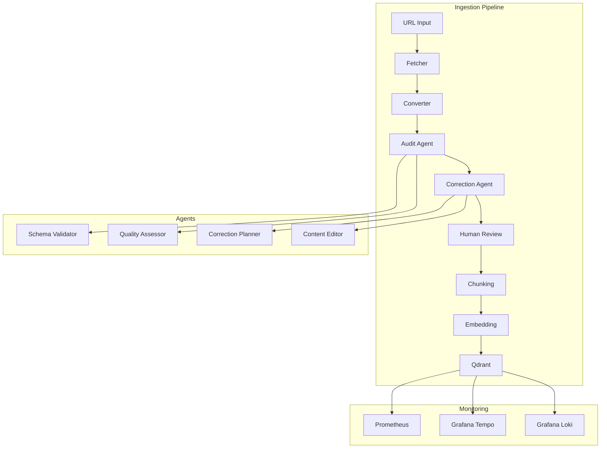

# RAG Pipeline Documentation

A production-grade document ingestion pipeline that crawls documentation websites, converts HTML to structured Markdown, validates quality via AI agents, and ingests into a Qdrant vector database for RAG (Retrieval-Augmented Generation) retrieval.

## Quick Navigation

- [Overview](#overview)
- [Architecture](#architecture)
- [Quick Start](#quick-start)
- [API Documentation](#api-documentation)
- [Project Phases](#project-phases)
- [Technology Stack](#technology-stack)
- [MCP Integration](#mcp-integration)
- [Observability](#observability)
- [Deployment](#deployment)

---

## Overview

The RAG Pipeline is a complete end-to-end solution for building AI knowledge bases from documentation websites. It automates the entire process from content discovery to vector ingestion:

```
URL → Fetch → Convert → Audit Agent → Correction Agent → Human Review → Chunk → Embed → Qdrant
```

### Key Features

- **Automated Content Discovery**: Crawl documentation sites and discover linked pages
- **AI-Powered Quality Control**: Schema validation and quality assessment using LangGraph agents with OpenAI-compatible LLM (qwen3-coder-next)
- **Human-in-the-Loop Review**: Interactive review dashboard with Monaco editor
- **Vector Embeddings**: Local ONNX embeddings with FastEmbed
- **Vector Search**: Qdrant integration for semantic search
- **Production Hardening**: JWT authentication, rate limiting, observability stack

### System Architecture



---

## Quick Start

### Prerequisites

- Docker & Docker Compose
- Node.js 22+
- pnpm 9+
- Python 3.13+

### Development Setup

```bash
# Clone and install
cd rag-pipeline
pnpm install

# Install API dependencies
cd apps/api && pip install -e ".[dev]"
cd ../..

# Install Playwright browser
cd apps/api && playwright install chromium

# Start infrastructure services
cd infra && docker compose up -d

# Run database migrations
cd ../apps/api && alembic upgrade head

# Start development servers
cd ../..
pnpm dev  # starts both API and web
```

### Access Points

- **Frontend**: http://localhost:3000
- **API**: http://localhost:8000
- **API Docs**: http://localhost:8000/docs
- **Grafana**: http://localhost:3001 (admin/admin)
- **Prometheus**: http://localhost:9090
- **Qdrant**: http://localhost:6333

---

## API Documentation

### Endpoints

| Method | Endpoint | Description |
|--------|----------|-------------|
| `POST` | `/api/v1/jobs` | Create ingestion job |
| `GET` | `/api/v1/jobs/{id}` | Get job details |
| `GET` | `/api/v1/jobs/{id}/status` | Get job status |
| `GET` | `/api/v1/jobs/{id}/documents` | List documents |
| `POST` | `/api/v1/jobs/{id}/audit` | Trigger audit workflow |
| `POST` | `/api/v1/jobs/{id}/start-loop` | Start A2A loop |
| `POST` | `/api/v1/ingest/jobs/{id}/chunk` | Trigger chunking |
| `POST` | `/api/v1/ingest/jobs/{id}/embed` | Start embedding to Qdrant |
| `GET` | `/api/v1/ingest/collections` | List collections |
| `POST` | `/api/v1/ingest/collections/{name}/search` | Search knowledge base |
| `GET` | `/api/v1/health` | Liveness check |
| `GET` | `/api/v1/health/ready` | Readiness check |

### Authentication

JWT tokens are required for protected endpoints:

```bash
# Login
curl -X POST http://localhost:8000/api/v1/auth/login \
  -H "Content-Type: application/json" \
  -d '{"email":"admin@example.com","password":"changeme"}'

# Use token
curl http://localhost:8000/api/v1/jobs \
  -H "Authorization: Bearer <token>"
```

---

## Project Phases

| Phase | Status | Description |
|-------|--------|-------------|
| Phase 1 | ✅ Complete | Mono-repo, Infrastructure, FastAPI, Next.js, CI/CD |
| Phase 2 | ✅ Complete | URL Crawler, HTML Fetcher, Markdown Converter |
| Phase 3 | ✅ Complete | Audit Agent with LangGraph |
| Phase 4 | ✅ Complete | Correction Agent with A2A Protocol |
| Phase 5 | ✅ Complete | Human Review Interface |
| Phase 6 | ✅ Complete | Chunking, Embedding, Qdrant Integration |
| Phase 7 | ✅ Complete | MCP Server, Observability, Auth, Production Hardening |

### Detailed Phase Documentation

- [Phase 1: Foundation](plans/phase-1-foundation.md)
- [Phase 2: Crawl & Convert](plans/phase-2-crawl-and-convert.md)
- [Phase 3: Audit Agent](plans/phase-3-audit-agent.md)
- [Phase 4: Correction Agent](plans/phase-4-correction-agent.md)
- [Phase 5: Human Review](plans/phase-5-human-review.md)
- [Phase 6: Vector Ingestion](plans/phase-6-vector-ingestion.md)
- [Phase 7: MCP & Hardening](plans/phase-7-mcp-and-hardening.md)

---

## Technology Stack

### Backend

| Component | Technology | Version |
|-----------|------------|---------|
| Web Framework | FastAPI | 0.135.3 |
| ORM | SQLAlchemy | 2.0.49 |
| Migrations | Alembic | 1.18.4 |
| Task Queue | Celery | 5.6.3 |
| Workflow Orchestrator | LangGraph | 1.1.6 |
| A2A Protocol | a2a-sdk | 0.3.26 |
| MCP Server | mcp | 1.27.0 |

### Frontend

| Component | Technology | Version |
|-----------|------------|---------|
| Framework | Next.js | 16.2.3 |
| State Management | Redux Toolkit | 2.11.2 |
| API Client | RTK Query | - |
| UI Library | shadcn/ui | 4.x |
| Markdown Editor | Monaco Editor | 4.7.0 |

### Infrastructure

| Component | Technology | Version |
|-----------|------------|---------|
| Container Runtime | Docker | 27.x |
| Database | PostgreSQL | 17 |
| Cache | Redis | 7.x |
| Vector DB | Qdrant | 1.13+ |
| Reverse Proxy | Traefik | 3.6.13 |

### Observability

| Component | Technology | Version |
|-----------|------------|---------|
| Metrics | Prometheus | 3.4 |
| Tracing | Grafana Tempo | 2.7 |
| Logging | Grafana Loki | 3.5 |
| Dashboards | Grafana | 11.6 |

---

## MCP Integration

The pipeline exposes its tools via the Model Context Protocol (MCP) **Streamable HTTP transport**:

```
POST http://localhost:8000/mcp
```

### Available Tools

| Tool Name | Description |
|-----------|-------------|
| `ingest_url` | Create ingestion job from URL |
| `get_job_status` | Retrieve job status and progress |
| `list_documents` | List documents for a job |
| `get_audit_report` | Get audit report JSON for rounds |
| `search_knowledge_base` | Query Qdrant vector store |
| `approve_job` | Trigger human approval workflow |
| `get_collection_stats` | Get Qdrant collection statistics |

### Claude Desktop Configuration

Add to `claude_desktop_config.json`:

```json
{
  "mcpServers": {
    "rag-pipeline": {
      "type": "http",
      "url": "http://localhost:8000/mcp"
    }
  }
}
```

---

## Observability

The pipeline includes a complete open-source observability stack:

| Component | URL | Purpose |
|-----------|-----|---------|
| Grafana | http://localhost:3001 | Dashboards and exploration |
| Prometheus | http://localhost:9090 | Metrics scraping |
| Tempo | http://localhost:3200 | Distributed tracing |
| Loki | http://localhost:3100 | Log aggregation |

### Viewing Traces

1. Go to Grafana → Explore → Tempo
2. Filter by `service.name=rag-pipeline-api`
3. Click on spans to view agent runs

### Viewing Logs

1. Go to Grafana → Explore → Loki
2. Query: `{job="rag-pipeline-api"} | json | level="error"`

---

## Deployment

### Production Deployment

```bash
# Validate merged configuration
docker compose -f docker-compose.yml -f infra/docker-compose.prod.yml config

# Deploy production stack
docker compose -f docker-compose.yml -f infra/docker-compose.prod.yml up -d

# Run migrations
docker compose exec api alembic upgrade head
```

### Environment Variables

| Variable | Description |
|----------|-------------|
| `JWT_SECRET` | Secret key for JWT signing |
| `RATE_LIMIT` | Rate limit (e.g., "100/minute") |
| `LOG_FORMAT` | "json" for production, "console" for dev |
| `OTEL_ENABLED` | Enable OpenTelemetry tracing |
| `EMBEDDING_MODEL` | FastEmbed model (default: BAAI/bge-small-en-v1.5) |
| `QDRANT_URL` | Qdrant instance URL |

---

## Contributing

1. Follow the phase plan structure in `ai-workspace/plans/`
2. Each phase has subtasks with specific validation criteria
3. Run validation scripts after implementing each phase
4. Update documentation as you add features

---

## Support

For issues and questions:

- Check the [Operations Runbook](runbook.md) for common issues
- Review [Lessons Learned](../ai-workspace/docs/lessons-learned.md) for anti-patterns
- Consult the [consolidated summary report](../ai-workspace/summary-reports/consolidated-rag-pipeline-summary-report-2026-04-17.md) for project overview

---

*Last updated: 2026-04-23*
