# Architecture Documentation

Detailed technical architecture of the RAG Pipeline system.

## Table of Contents

- [System Overview](#system-overview)
- [Pipeline Architecture](#pipeline-architecture)
- [Data Flow](#data-flow)
- [Agent Architecture](#agent-architecture)
- [Database Schema](#database-schema)
- [API Design](#api-design)
- [Security Architecture](#security-architecture)
- [Deployment Architecture](#deployment-architecture)

---

## System Overview

```
┌─────────────────────────────────────────────────────────────────────────┐
│                         RAG Pipeline Architecture                        │
├─────────────────────────────────────────────────────────────────────────┤
│                                                                          │
│  ┌──────────────┐    ┌──────────────┐    ┌──────────────┐              │
│  │   Frontend   │    │    API     │    │   Database   │              │
│  │  (Next.js)   │←──→│  (FastAPI) │←──→│ (PostgreSQL) │              │
│  └──────────────┘    └──────────────┘    └──────────────┘              │
│           │                  │                  │                       │
│           │                  │                  │                       │
│           ▼                  ▼                  ▼                       │
│  ┌──────────────────────────────────────────────────────┐              │
│  │                   Docker Services                      │              │
│  ├──────────────────────────────────────────────────────┤              │
│  │  traefik (8080)  │  api (8000)  │  web (3000)         │              │
│  │  postgres (5432) │  redis (6379)│  qdrant (6333)      │              │
│  │  celery-worker     │  tempo (4317)│ loki (3100)         │              │
│  └──────────────────────────────────────────────────────┘              │
│                                                                          │
└─────────────────────────────────────────────────────────────────────────┘
```

### Service Breakdown

| Service | Port | Purpose |
|---------|------|---------|
| traefik | 80 | Public entry point (API, Web, MCP) |
| traefik | 8080 | Traefik dashboard |
| api | 8000 | FastAPI backend (internal, behind Traefik) |
| web | 3000 | Next.js frontend (internal, behind Traefik) |
| postgres | 5432 | PostgreSQL 17 database |
| redis | 6379 | Redis 7 cache and broker |
| qdrant | 6333 | Qdrant vector database |
| qdrant | 6334 | Qdrant gRPC |
| celery-worker | - | Celery task worker |
| tempo | 4317 | Grafana Tempo (tracing) |
| loki | 3100 | Grafana Loki (logging) |
| grafana | 3001 | Grafana dashboards |
| prometheus | 9090 | Prometheus metrics |

---

## Pipeline Architecture

### Complete Ingestion Pipeline

```
┌─────────────────────────────────────────────────────────────────────┐
│                    Ingestion Pipeline Flow                          │
├─────────────────────────────────────────────────────────────────────┤
│                                                                      │
│  1. Input                                                           │
│     └── URL (documentation site or page)                           │
│                                                                      │
│  2. Crawl                                                           │
│     ├── Fetcher (httpx + Playwright)                               │
│     ├── Link Discovery (CSS selectors + LLM fallback)              │
│     └── Staging (local files)                                      │
│                                                                      │
│  3. Convert                                                         │
│     └── markitdown (HTML → Markdown with frontmatter)             │
│                                                                      │
│  4. Audit                                                           │
│     └── LangGraph 6-node workflow:                                 │
│         ├── validate_schema (deterministic rules)                  │
│         ├── assess_quality (Claude LLM)                           │
│         ├── check_duplicates (content hashing)                     │
│         └── compile_report                                         │
│                                                                      │
│  5. Correction                                                      │
│     └── A2A Protocol Loop:                                         │
│         ├── Audit Agent → Error Report                            │
│         ├── Correction Agent → Fixed Content                      │
│         └── Loop until approved or max rounds reached              │
│                                                                      │
│  6. Human Review                                                    │
│     └── Monaco editor + diff viewer with approval workflow         │
│                                                                      │
│  7. Ingest                                                          │
│     ├── Chunking (tiktoken-aware, heading-path tracking)           │
│     ├── Embedding (FastEmbed ONNX)                                │
│     └── Qdrant upsert (vector storage)                            │
│                                                                      │
└─────────────────────────────────────────────────────────────────────┘
```

### Pipeline State Machine

```
┌──────────┐     ┌──────────┐     ┌──────────┐     ┌──────────┐
│ PENDING  │────▶│ CRAWLING │────▶│AUDITING  │────▶│CORRECTING│
└──────────┘     └──────────┘     └──────────┘     └──────────┘
                                      │                │
                                      │                ▼
                                      │         ┌──────────┐
                                      │         │  REVIEW  │
                                      │         └──────────┘
                                      │                │
                                      ▼                ▼
                                 ┌──────────┐     ┌──────────┐
                                 │APPROVED  │     │  FAILED  │
                                 └──────────┘     └──────────┘
```

---

## Data Flow

### Document Processing Flow

```
┌──────────────────────────────────────────────────────────────────┐
│                     Document Processing Flow                     │
├──────────────────────────────────────────────────────────────────┤
│                                                                  │
│  HTML Content                                                    │
│       │                                                          │
│       ▼                                                          │
│  ┌──────────────┐                                                │
│  │   Fetcher    │ → Static mode (httpx)                         │
│  │              │ → Browser mode (Playwright)                   │
│  └──────────────┘                                                │
│       │                                                          │
│       ▼                                                          │
│  ┌────────────────┐                                              │
│  │ Markdown       │ → Title, description, tags, status          │
│  │ Frontmatter    │ → YAML metadata                             │
│  └────────────────┘                                              │
│       │                                                          │
│  ┌────────────────────────┐                                      │
│  │  Audit Agent (LangGraph)│                                     │
│  │  - Schema validation   │ → Rule-based checks                 │
│  │  - Quality assessment  │ → LLM evaluation                    │
│  │  - Duplicate check     │ → Content hash comparison           │
│  └────────────────────────┘                                      │
│       │                                                          │
│       ▼                                                          │
│  ┌──────────────────┐                                            │
│  │ Audit Report JSON│                                            │
│  │  - Issues array  │                                           │
│  │  - Severity      │                                           │
│  │  - Suggestions   │                                           │
│  └──────────────────┘                                            │
│       │                                                          │
│       ▼                                                          │
│  ┌────────────────────┐  ┌────────────────────┐                 │
│  │ Issues Found       │  │ Zero Issues        │                 │
│  │ → Correction Agent │  │ → Human Review     │                 │
│  └────────────────────┘  └────────────────────┘                 │
│       │                                                          │
│       ▼                                                          │
│  ┌──────────────────┐                                            │
│  │ Human Review UI  │ → Monaco editor + diff view               │
│  └──────────────────┘                                            │
│       │                                                          │
│       ▼                                                          │
│  ┌──────────────────┐                                            │
│  │  Approve/Reject  │ → Updated content saved                   │
│  └──────────────────┘                                            │
│       │                                                          │
│       ▼                                                          │
│  ┌────────────────────────┐                                      │
│  │  Chunking Pipeline     │ → Tiktoken-aware tokens             │
│  │  - heading-path        │ → Context preservation               │
│  │  - overlap_tokens      │ → Context window overlap            │
│  └────────────────────────┘                                      │
│       │                                                          │
│       ▼                                                          │
│  ┌────────────────────────┐                                      │
│  │  Embedding Service     │ → FastEmbed ONNX model              │
│  └────────────────────────┘                                      │
│       │                                                          │
│       ▼                                                          │
│  ┌────────────────────────┐                                      │
│  │  Qdrant Ingestion      │ → Vector upsert with metadata       │
│  └────────────────────────┘                                      │
│                                                                  │
└──────────────────────────────────────────────────────────────────┘
```

---

## Agent Architecture

### LangGraph Audit Agent

```
┌─────────────────────────────────────────────────────────────────────┐
│                    Audit Agent (6-node graph)                       │
├─────────────────────────────────────────────────────────────────────┤
│                                                                      │
│  load_documents → validate_schema → assess_quality                 │
│                                       ↓                             │
│                              check_duplicates                       │
│                                       ↓                             │
│                              compile_report                         │
│                                       ↓                             │
│                              save_report                            │
│                                                                      │
└─────────────────────────────────────────────────────────────────────┘
```

### Audit Workflow Nodes

| Node | Description |
|------|-------------|
| `load_documents` | Load staged Markdown files |
| `validate_schema` | Rule-based validation (10 rules) |
| `assess_quality` | Claude LLM quality assessment |
| `check_duplicates` | Content hash comparison |
| `compile_report` | Aggregate results |
| `save_report` | Store in database |

### Correction Agent (A2A Protocol)

```
┌─────────────────────────────────────────────────────────────────────┐
│                  Correction Agent (A2A Protocol)                    │
├─────────────────────────────────────────────────────────────────────┤
│                                                                      │
│  A2A Client Orchestrator                                           │
│       │                                                              │
│       ├── POST /a2a/audit/tasks → Audit Report                    │
│       │                                                              │
│       └── POST /a2a/correction/tasks → Error Report               │
│            └── Agent Card: correction-agent-v1                    │
│                                                                      │
│  Correction Workflow (6-node graph)                                │
│                                                                      │
│  receive_report → classify_issues → plan_corrections               │
│                                        ↓                            │
│                                  apply_corrections                  │
│                                        ↓                            │
│                                  save_corrections                   │
│                                        ↓                            │
│                                  emit_complete                      │
│                                                                      │
└─────────────────────────────────────────────────────────────────────┘
```

### Agent Cards

**Audit Agent**
- ID: `audit-agent-v1`
- Name: RAG Audit Agent
- Description: Validates Markdown schema and assesses quality
- Input modes: `text`, `markdown`
- Output modes: `json`

**Correction Agent**
- ID: `correction-agent-v1`
- Name: RAG Correction Agent
- Description: Fixes issues in Markdown documents
- Input modes: `text`, `markdown`, `json`
- Output modes: `text`, `markdown`

---

## Database Schema

### Core Tables

```mermaid
erDiagram
    INGESTION_JOBS ||--o{ DOCUMENTS : has
    INGESTION_JOBS ||--o{ AUDIT_REPORTS : has
    INGESTION_JOBS ||--o{ VECTOR_COLLECTIONS : has
    DOCUMENTS ||--o{ CHUNKS : has
    DOCUMENTS ||--o{ REVIEW_DECISIONS : has
    DOCUMENTS ||--o{ REVIEW_COMMENTS : has

    INGESTION_JOBS {
        uuid id PK
        text url
        varchar(30) status
        boolean crawl_all_docs
        integer total_documents
        integer processed_documents
        integer current_audit_round
        timestamp created_at
        timestamp updated_at
    }

    DOCUMENTS {
        uuid id PK
        uuid job_id FK
        text url
        varchar(255) title
        text markdown_path
        varchar(30) status
        integer word_count
        integer quality_score
        varchar(64) content_hash
        timestamp created_at
        timestamp updated_at
    }

    AUDIT_REPORTS {
        uuid id PK
        uuid job_id FK
        integer round_number
        integer total_issues
        jsonb issues_json
        text summary
        varchar(30) status
        text agent_notes
        timestamp created_at
        timestamp updated_at
    }

    CHUNKS {
        uuid id PK
        uuid document_id FK
        uuid job_id FK
        integer chunk_index
        text content
        integer token_count
        jsonb metadata
        vector(384) embedding
        varchar(30) embedding_status
        timestamp created_at
        timestamp updated_at
    }

    VECTOR_COLLECTIONS {
        uuid id PK
        uuid job_id FK
        varchar(255) collection_name
        integer vector_dimensions
        integer vector_count
        integer document_count
        varchar(30) status
        text error_message
        timestamp created_at
        timestamp updated_at
    }

    REVIEW_DECISIONS {
        uuid id PK
        uuid document_id FK
        uuid job_id FK
        varchar(30) decision
        text reviewer_notes
        text edited_content
        timestamp created_at
        timestamp updated_at
    }

    REVIEW_COMMENTS {
        uuid id PK
        uuid document_id FK
        integer line_number
        text content
        varchar(50) author
        boolean resolved
        timestamp created_at
        timestamp updated_at
    }
```



### Indexes

```sql
-- Ingestion Jobs
CREATE INDEX idx_jobs_status ON ingestion_jobs(status);
CREATE INDEX idx_jobs_created_at ON ingestion_jobs(created_at);

-- Documents
CREATE INDEX idx_docs_job_id ON documents(job_id);
CREATE INDEX idx_docs_status ON documents(status);
CREATE INDEX idx_docs_content_hash ON documents(content_hash);

-- Chunks
CREATE INDEX idx_chunks_document_id ON chunks(document_id);
CREATE INDEX idx_chunks_job_id ON chunks(job_id);
CREATE INDEX idx_chunks_embedding_status ON chunks(embedding_status);

-- Audit Reports
CREATE INDEX idx_audit_job_round ON audit_reports(job_id, round_number);
```

---

## API Design

### RESTful Endpoints

| Method | Path | Description |
|--------|------|-------------|
| `POST` | `/api/v1/jobs` | Create ingestion job |
| `GET` | `/api/v1/jobs/{id}` | Get job details |
| `GET` | `/api/v1/jobs/{id}/status` | Get job status (lightweight) |
| `GET` | `/api/v1/jobs/{id}/documents` | List documents for job |
| `GET` | `/api/v1/jobs/{id}/documents/{doc_id}` | Get document content |
| `DELETE` | `/api/v1/jobs/{id}/documents/{doc_id}` | Remove document |
| `POST` | `/api/v1/jobs/{id}/audit` | Trigger audit workflow |
| `GET` | `/api/v1/jobs/{id}/audit-reports` | List audit reports |
| `GET` | `/api/v1/jobs/{id}/audit-reports/{report_id}` | Get full report |
| `POST` | `/api/v1/jobs/{id}/start-loop` | Start A2A loop |
| `POST` | `/api/v1/jobs/{id}/stop-loop` | Stop loop |
| `GET` | `/api/v1/jobs/{id}/loop-status` | Get loop status |
| `POST` | `/api/v1/ingest/jobs/{id}/chunk` | Trigger chunking |
| `GET` | `/api/v1/ingest/jobs/{id}/chunks` | List chunks (paginated) |
| `GET` | `/api/v1/ingest/jobs/{id}/chunks/{chunk_id}` | Get chunk details |
| `GET` | `/api/v1/ingest/jobs/{id}/chunk-stats` | Get chunk statistics |
| `POST` | `/api/v1/ingest/jobs/{id}/embed` | Start embedding |
| `GET` | `/api/v1/ingest/collections` | List collections |
| `GET` | `/api/v1/ingest/collections/{name}/stats` | Get collection stats |
| `POST` | `/api/v1/ingest/collections/{name}/search` | Search knowledge base |
| `POST` | `/api/v1/auth/login` | Login and receive JWT |
| `GET` | `/api/v1/health` | Liveness check |
| `GET` | `/api/v1/health/ready` | Readiness check |

### Request/Response Examples

**Create Ingestion Job**

```bash
POST /api/v1/jobs
Content-Type: application/json

{
  "url": "https://example.com/docs",
  "crawl_all_docs": true
}

Response: 201 Created
{
  "id": "uuid",
  "url": "https://example.com/docs",
  "status": "pending",
  "crawl_all_docs": true,
  "created_at": "2026-04-19T01:00:00Z"
}
```

**Start Audit**

```bash
POST /api/v1/jobs/{id}/audit

Response: 202 Accepted
{
  "message": "Audit workflow started",
  "job_id": "uuid"
}
```

**Search Knowledge Base**

```bash
POST /api/v1/ingest/collections/{name}/search
Content-Type: application/json

{
  "query": "how to configure authentication",
  "top_k": 5
}

Response: 200 OK
{
  "results": [
    {
      "chunk_id": "uuid",
      "content": "...",
      "metadata": {...},
      "score": 0.89
    }
  ]
}
```

---

## Security Architecture

### Authentication

**JWT Token Structure**

```json
{
  "sub": "user@example.com",
  "role": "admin",
  "iat": 1713516000,
  "exp": 1713602400
}
```

**Roles**

| Role | Permissions |
|------|-------------|
| `viewer` | Read-only access |
| `editor` | Read + write operations |
| `admin` | Full access including delete |

### Rate Limiting

**Configuration**

```env
RATE_LIMIT=100/minute
```

**Example Response (429)**

```json
{
  "error": "Rate limit exceeded",
  "detail": "100 per 1 minute",
  "retry_after": 42
}
```

### SSRF Prevention

**Blocked IP Ranges**

```
10.0.0.0/8              (RFC 1918)
172.16.0.0/12           (RFC 1918)
192.168.0.0/16          (RFC 1918)
127.0.0.0/8             (loopback)
169.254.0.0/16          (link-local)
::1/128                 (IPv6 loopback)
fc00::/7                (IPv6 private)
fe80::/10               (IPv6 link-local)
```

**Validation Flow**

```
URL Input
    │
    ▼
Parse URL → Check scheme (http/https only)
    │
    ▼
Resolve hostname to IP
    │
    ▼
Check IP against blocked networks
    │
    └──► Blocked → SSRFError (400)
    │
    └──► Allowed → Proceed
```

---

## Deployment Architecture

### Development Stack

```yaml
# infra/docker-compose.dev.yml
services:
  api:
    command: uvicorn src.main:app --reload
    volumes:
      - ../apps/api/src:/app/src:cached

  web:
    command: pnpm dev
    volumes:
      - ../apps/web/src:/app/src:cached
```

### Production Stack

```yaml
# infra/docker-compose.prod.yml
services:
  api:
    restart: always
    deploy:
      resources:
        limits:
          cpus: "2.0"
          memory: 2G
    healthcheck:
      test: ["CMD", "curl", "-f", "http://localhost:8000/health"]
      interval: 30s
      timeout: 10s
      retries: 3
      start_period: 40s

  postgres:
    command: >
      postgres
      -c max_connections=100
      -c shared_buffers=256MB
      -c effective_cache_size=768MB
      -c work_mem=4MB
```

### Docker Compose Command

```bash
# Development
docker compose -f docker-compose.yml up -d

# Production
docker compose -f docker-compose.yml -f infra/docker-compose.prod.yml up -d

# View services
docker compose ps

# View logs
docker compose logs -f api
```

---

## Observability Stack

### Tracing

```
FastAPI → OpenTelemetry → Tempo (OTLP)
Celery → OpenTelemetry → Tempo (OTLP)
httpx → OpenTelemetry → Tempo (OTLP)
```

### Metrics

```
Prometheus FastAPI Instrumentator
  ├── http_request_duration_seconds
  ├── http_requests_total
  └── rag_* custom metrics

Custom Metrics:
  - rag_jobs_created_total
  - rag_jobs_completed_total
  - rag_jobs_failed_total
  - rag_agent_rounds_per_job
  - rag_embed_latency_seconds
  - rag_chunks_embedded_total
  - rag_qdrant_upsert_latency_seconds
```

### Logging

```
structlog → JSON format
  └── Loki (Grafana)

Log fields:
  - level
  - trace_id (from OTel)
  - span_id (from OTel)
  - timestamp
  - message
  - service_name
```

---

*Last updated: 2026-04-19*
